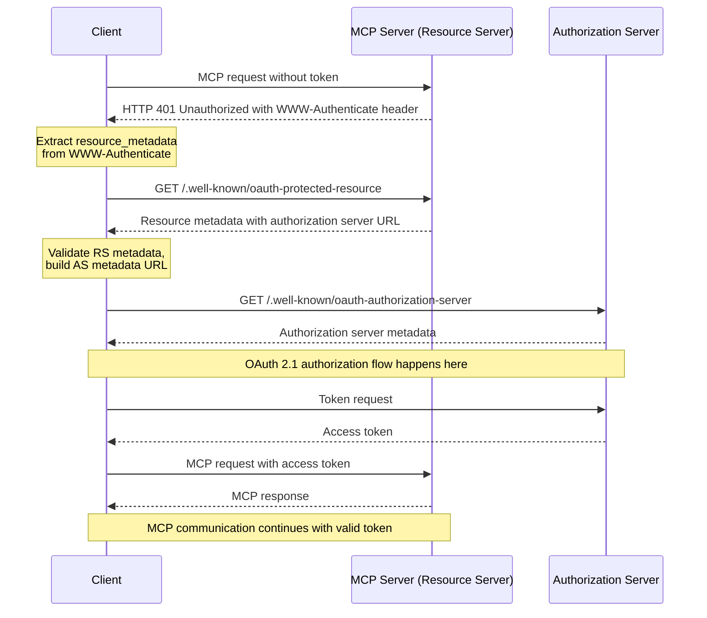
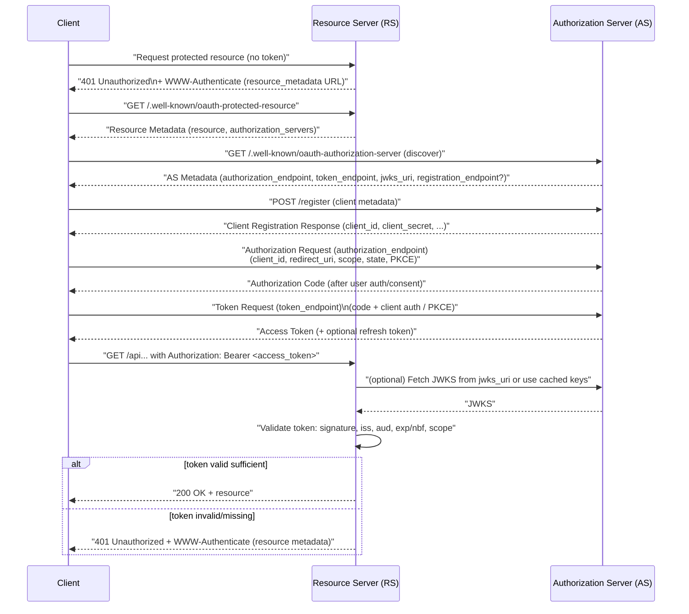

# MCP 授权设计

## Authorization Flow  授权流程

### 1. 背景(Background)

这份设计基于 MCP 2025-06-18 授权规范。Pixiu 已有把后端 API 包装为 MCP Server 的能力，这一步希望在网关入口验证访问令牌并控制权限。

### 2. 核心原则与角色定位 (Core Principles & Role)

#### 2.1 Pixiu 的角色抉择：资源服务器

对于 Pixiu 网关而言，其核心职责是保护后端的 API 服务，因此我觉得包装成 Resource Server 是更好且正确的选择。

Pixiu 接受并验证访问令牌，授权服务器负责用户授权和令牌颁发。这样可以沿用独立的授权服务，代价是需要额外配置和部署它。把两种角色都放进网关，会扩大网关承担的职责。

参考：[OAuth 2.1 角色](https://www.ietf.org/archive/id/draft-ietf-oauth-v2-1-13.html#name-roles)、[MCP 授权服务器发现](https://modelcontextprotocol.io/specification/2025-06-18/basic/authorization#authorization-server-discovery)。

#### 2.2. 授权流程概览



### 3. 约束与目标(Constraints & Goals)

#### 3.1 功能约束

- 提供 [RFC 9728 保护资源元数据](https://datatracker.ietf.org/doc/html/rfc9728)，让客户端发现授权服务器。
- 元数据可列出多个授权服务器，由客户端选择，见 [RFC 9728 §7.6](https://datatracker.ietf.org/doc/html/rfc9728#name-authorization-servers)。
- 返回 401 时，通过 `WWW-Authenticate` 告知资源元数据地址，见 [RFC 9728 §5.1](https://datatracker.ietf.org/doc/html/rfc9728#name-www-authenticate-response)。
- 校验令牌及其目标接收方，确认令牌确实签发给当前资源服务，见 [OAuth 2.1 §5.2](https://datatracker.ietf.org/doc/html/draft-ietf-oauth-v2-1-13#section-5.2) 与 [RFC 8707 §2](https://www.rfc-editor.org/rfc/rfc8707.html#section-2)。
- 缺失、无效或过期的令牌返回 401；有效令牌权限不足时返回 403。错误处理参考 [OAuth 2.1 §5.3](https://datatracker.ietf.org/doc/html/draft-ietf-oauth-v2-1-13#section-5.3)。

#### 3.2 安全约束

**杜绝硬编码密钥**: 严禁在代码或配置中硬编码任何对称密钥或私钥。公钥应通过标准的 `jwks_uri` 动态获取。

**核心声明验证**: 必须强制验证令牌的 `iss` (Issuer), `aud` (Audience), `exp` (Expiration Time) 声明。

**缓存安全**: 元数据和公钥的缓存必须有明确的过期策略 (TTL)，以响应密钥轮换等安全事件。

#### 3.3 技术选型

方案选择 `github.com/lestrrat-go/jwx`，主要考虑 JOSE 能力、JWKS 获取与缓存可放在同一套库中，减少分散的依赖。

本次先实现 `mcp_auth` 过滤器；现有 JWT 过滤器的依赖清理和重构留在后续，不把计划中的能力写成已经完成的结果。

### 4. 设计方案 (Design & Implementation)

本方案旨在通过引入 `github.com/lestrrat-go/jwx` 库，新增一个完全符合 MCP 规范的 OAuth 2.0 资源服务器过滤器 (`mcp_auth`)。为遵循务实、迭代的原则，**本次实施将集中于交付新的 `mcp_auth` 过滤器，对现有 `jwt` 过滤器的重构将暂缓**，作为后续的技术优化任务。

#### 4.1 架构与文件结构

为避免过度设计，我们将核心的 JWT 验证逻辑内聚在 `mcp` 过滤器内部，采用 `internal` 包来明确其私有性。最终文件结构如下：

```text

pkg/filter/auth/
├── jwt/                   # [保留, 本次不改动]
│   └── ...
│
├── mcp/                   # [新增] 新的 MCP 认证过滤器
│   ├── filter.go          # 实现 MCP 协议流程
│   ├── config.go          # MCP 过滤器相关配置
│   └── internal/          # [新增] 存放 MCP 过滤器内部使用的逻辑
│       └── validator/
│           ├── validator.go
│           └── config.go

```

#### 4.2 核心验证器 (`mcp/internal/validator/`)

此包负责提供专供 `mcp` 过滤器使用的、基于 `jwx` 的令牌验证能力。

**配置 (`config.go`)**:
*   定义 `Provider` 结构，包含 `issuer`, `audiences` 和 `jwks_source` 等字段。

**验证器 (`validator.go`)**:
*   **`NewValidator(providers)` (伪代码)**:

    ```go
    // 接收Provider配置列表
    // for each provider:
    //   根据 jwks_source (remote/local)
    //   创建 jwk.NewAutoRefresh() 或 jwk.Parse() 实例 (jwk.Set)
    //   将 jwk.Set 和 provider 元数据存入 map
    // return validator_instance
    ```

*   **`Validate(providerName, tokenString)` (伪代码)**:

    ```go
    // providerRules = find_rules_for(providerName)
    // jwt.Parse(token,
    //   jwt.WithKeySet(providerRules.keySet),
    //   jwt.WithIssuer(providerRules.issuer),
    //   jwt.WithAnyAudience(providerRules.audiences...)
    // )
    // return token, err
    ```

#### 4.3 `mcp` 认证过滤器 (`mcp/`)

**配置 (`config.go`)**:
*   定义顶层 `Config` 结构，包含 `ResourceMetadata` 和 `Rules`。
*   `ResourceMetadata`: 定义 `/.well-known` 端点的内容，包括 `server_host` 和 `authorization_servers` 列表。
*   `Rules`: 定义 `path_prefix` 到 `required_scopes` 和 `provider_name` 的映射。

**过滤器逻辑 (`filter.go`)** (伪代码):

```go
// 在 Factory.Apply() 中:
// validator = internal.NewValidator(config.Providers)

// 在 Filter.Decode() 中:
// if path == "/.well-known/oauth-protected-resource":
//   return metadata_json

// rule = find_matching_rule(path)
// if rule == nil:
//   return Continue

// token = extract_bearer_token(request)
// if token == nil:
//   return 401_with_www_authenticate_header()

// validatedToken, err = validator.Validate(rule.ProviderName, token)
// if err != nil:
//   return 401_with_standard_error_body("invalid_token", err)

// // 注意: `scope` 声明是空格分隔的字符串, 实现时需分割处理
// if !check_scopes(validatedToken.Scopes, rule.RequiredScopes):
//   return 403_with_standard_error_body("insufficient_scope", "Token has insufficient scope")

// return Continue
```

#### 4.4 错误处理 (Error Handling)

所有认证/授权相关的 `4xx` 错误响应，其响应体都应为 JSON 格式，并遵循 OAuth 2.0 规范，至少包含 `error` 和 `error_description` 字段，以提供清晰的客户端错误信息。

```json
// 示例: 403 Forbidden 响应
{
  "error": "insufficient_scope",
  "error_description": "The request requires higher privileges than provided by the access token."
}
```

#### 4.5 实施清单 (Implementation Checklist)

1.  [ ] 在 `go.mod` 中，添加 `github.com/lestrrat-go/jwx/v2`。
2.  [ ] 创建 `pkg/filter/auth/mcp/internal/validator/config.go` 并定义核心配置结构。
3.  [ ] 创建 `pkg/filter/auth/mcp/internal/validator/validator.go` 并实现 `NewValidator` 和 `Validate` 函数。
4.  [ ] 创建 `pkg/filter/auth/mcp/config.go` 并定义 MCP 过滤器配置结构。
5.  [ ] 创建 `pkg/filter/auth/mcp/filter.go` 并实现 MCP 认证流程调度逻辑。
6.  [ ] 在 `filter.go` 中实现标准的 OAuth 2.0 错误响应格式。
7.  [ ] 在 Pixiu 的插件注册表中，注册新的 `mcp_auth` 过滤器。
8.  [ ] 编写单元测试和集成测试，覆盖所有新功能，特别是声明验证、scope 检查和 `/.well-known` 端点。
9.  ~~[延后] 重构 `pkg/filter/auth/jwt/` 过滤器。~~

## Authorization 实现


