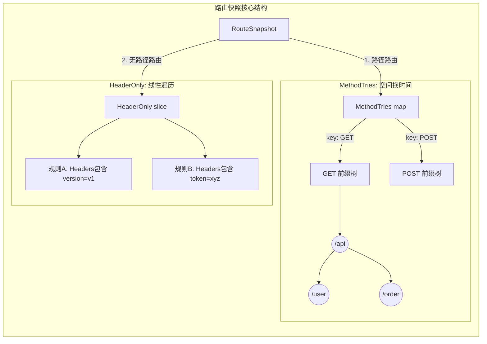
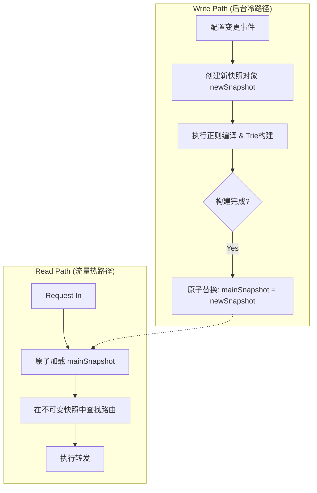

# 路由快照与前缀树重构

社区的小伙伴重构了 Pixiu 的路由模块，遂进行读取瞻仰，希望能有所收获。

PR：[路由模块重构](https://github.com/apache/dubbo-go-pixiu/pull/777)。

## RouteSnapshot 如何存路由

请求读多、配置更新少，因此把规则构建成快照：

- `MethodTries`：按 HTTP 方法分组，每组使用前缀树。配置了 `Path` 或 `Prefix` 的规则进入这里，即使它也包含 Header 条件。
- `HeaderOnly`：没有路径条件的规则存为切片，按规则逐个匹配 Header。

按方法分组后，不必在每个节点重复判断方法，也不必临时拼接 `GET:/api/v1` 之类的键。路径匹配主要取决于路径结构；Header-only 规则仍有线性遍历成本，不能把整条路由链路都称为 O(1)。

```go
// 简化的核心数据结构示意
type RouteSnapshot struct {
    // 第一层：优先匹配 Header 规则
    HeaderOnly []HeaderRoute

    // 第二层：按 Method 物理隔离的 Trie 森林
    // 读路径直接通过 MethodTries[req.Method] 定位子树
    MethodTries map[string]*trie.Trie
}
```



## 配置更新与请求读取分开

写路径在后台构建新快照，完成后通过 `atomic.Pointer` 发布。请求加载一个快照，并在本次查找中使用它；旧快照没有引用后由 GC 回收。

```go
type SnapshotHolder struct {
    ptr atomic.Pointer[RouteSnapshot]
}

func (h *SnapshotHolder) Load() *RouteSnapshot   { return h.ptr.Load() }
func (h *SnapshotHolder) Store(s *RouteSnapshot) { h.ptr.Store(s) }
```



成立的前提是**发布后的快照不再修改**，包括它引用的 map、切片和路由对象。原子替换指针不会自动让内部可变数据变安全。相比把查询和更新都放在读写锁中，这种方式减少了读请求等待配置更新的机会。

## 把重复工作移到配置变更时

正则编译、规则解析、Trie 构建都放到写路径。配置更新密集时，可以通过 debounce 合并构建，例如在 50ms 窗口内只处理最后一份配置；具体窗口要结合生效延迟要求选择。

“减少分配”和“降低请求耗时”是设计目的，实际收益需要 benchmark 确认。

## 阅读代码时补充的并发工具

### sync.Pool

用于复用临时对象，减少分配；池中的对象仍可能被清理。泛型包装能把类型断言集中在内部：

```go
// 定义一个带泛型的 Pool
type GenericPool[T any] struct {
    pool sync.Pool
}

// 封装 New 函数
func NewPool[T any](newFunc func() T) *GenericPool[T] {
    return &GenericPool[T]{
        pool: sync.Pool{
            New: func() any { return newFunc() },
        },
    }
}

// 封装 Get：自动帮你转类型！这就算是“人工语法糖”
func (p *GenericPool[T]) Get() T {
    return p.pool.Get().(T)
}

// 封装 Put
func (p *GenericPool[T]) Put(x T) {
    p.pool.Put(x)
}

// --- 使用起来就甜了 ---
// 1. 创建时指定类型
var myPool = NewPool(func() *[]int {
    s := make([]int, 0, 10)
    return &s
})

// 2. 使用时不需要断言了！直接拿到就是 *[]int
mySlice := myPool.Get()
```

对象归还前仍要清理残留数据，生命周期方面见 [[Go/sync.Pool 对象复用]]。

### sync.Map

适合特定的并发访问模式，例如写入一次后反复读取的缓存，或不同 goroutine 操作互不重叠的键。它不是普通 map 加锁方案的通用替代品，实际选择要结合访问模式。

```go
package main

import (
    "fmt"
    "sync"
)

func main() {
    var m sync.Map

    // 写入数据非常简单，直接 Store 即可，不需要关心锁
    m.Store("user_1", "Gemini")
    m.Store("user_2", "Claude")

    // 读取数据时，Load 返回两个值：value 和是否存在的布尔值
    // 注意：取出来的 value 是 any 类型，必须断言成 string 才能当字符串用
    if v, ok := m.Load("user_1"); ok {
        fmt.Println("Found user:", v.(string))
    }

    // 删除也是原子操作
    m.Delete("user_2")
}
```

`LoadOrStore` 原子地选择已有值或存入新值：

```go
// 假设这是一个正则缓存场景
func getOrCompileRegexp(m *sync.Map, pattern string) *regexp.Regexp {
    // LoadOrStore 尝试读取。
    // 如果 pattern 已存在，loaded 为 true，actual 返回旧值。
    // 如果 pattern 不存在，它会把新编译的正则存进去，loaded 为 false，actual 返回新值。
    newRe := regexp.MustCompile(pattern)
    actual, loaded := m.LoadOrStore(pattern, newRe)

    if loaded {
        fmt.Println("直接复用缓存里的正则对象")
    } else {
        fmt.Println("缓存未命中，已存入新对象")
    }

    return actual.(*regexp.Regexp)
}
```

这个示例只展示存入结果的原子性，`MustCompile` 在查缓存前就执行了，所以命中时仍会编译。实际缓存应先 `Load`；并发未命中时，`LoadOrStore` 也不保证编译只发生一次。

参考：[Go sync 文档](https://pkg.go.dev/sync)。
