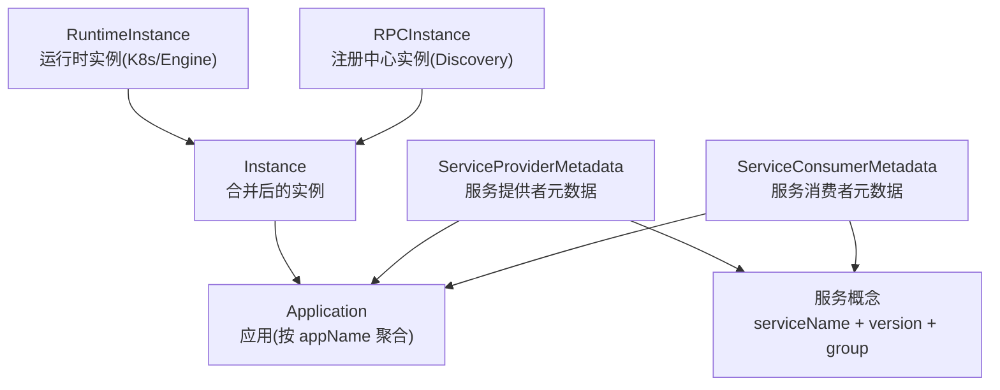

# Dubbo Admin 应用与实例模型

梳理 Dubbo Admin 源码中应用、服务和实例的关系。

## 三种实例

| 实体 | 来源 | 关注的信息 |
| --- | --- | --- |
| `RuntimeInstance` | K8s / Engine | `ip`、`rpcPort`、镜像、工作负载、节点、探针 |
| `RPCInstance` | Discovery | `ip`、`port`、协议、注册时间、序列化方式、端点 |
| `Instance` | 合并以上信息 | 控制台实例页使用的统一实例 |

运行时实例与注册实例是不同视角，控制台展示的是合并后的 `Instance`。

## 应用与服务

`Application` 按 `appName` 聚合，主要字段是 `name` 和 `instanceCount`。应用详情中的端口、镜像、协议和工作负载等信息，主要从该应用的 `Instance` 集合汇总。

服务用 `serviceName + version + group` 标识。一个应用可以提供和消费多个服务：

- `ServiceProviderMetadata` 记录提供者应用、方法、参数和类型信息。
- `ServiceConsumerMetadata` 记录消费关系。

## 页面与查询入口

- **实例页**：查询 `Instance`。
- **应用页**：先定位 `Application`，再查询和汇总该 `appName` 下的实例。
- **服务页**：围绕服务身份查询提供者、消费者及方法元数据。

例如，`shop-detail` 有两个 Pod，并且都注册为同一个服务的提供者：通常对应一个 `Application`、两份运行时实例信息、两份注册实例信息，以及合并后的两个 `Instance`；服务提供关系由 `ServiceProviderMetadata` 表达。

这些实体在调试接口中如何汇合，见 [[Dubbo/Dubbo Admin 泛化调用链路]]。
