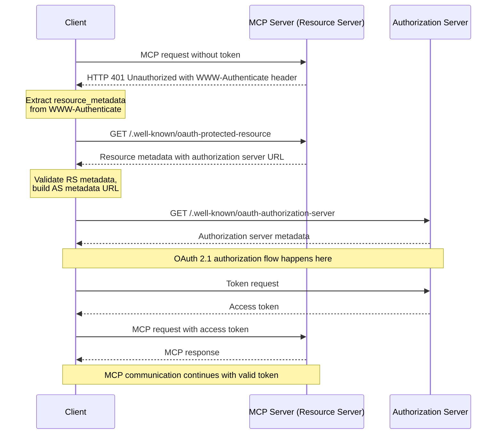

## Authorization Flow  授权流程

### 1. 背景(Background)

随着模型上下文协议 (Model Context Protocol, MCP) 的应用场景从本地环境扩展到开放的互联网，对服务进行访问控制和身份验证变得至关重要。这直接关系到 MCP Server 的核心安全性。当前，Pixiu 网关已经具备将后端 API 包装为 MCP Server 的能力，下一步的核心任务是利用网关的现有能力，集成一套标准的鉴权机制，以完整实现 MCP 规范中的授权 (Authorization) 要求。

MCP 规范明确指出：

	Implementations using an HTTP-based transport **SHOULD** conform to this specification.
	（基于 HTTP 的传输应该实现此规范。）

本方案旨在设计一个健壮、可扩展且符合行业最佳实践的授权流程。

### 2. 核心原则与角色定位 (Core Principles & Role)

#### 2.1 Pixiu 的角色抉择：资源服务器

> A protected _MCP server_ acts as an [OAuth 2.1 resource server](https://www.ietf.org/archive/id/draft-ietf-oauth-v2-1-13.html#name-roles), capable of accepting and responding to protected resource requests using access tokens.
> 
> The _authorization server_ is responsible for interacting with the user (if necessary) and issuing access tokens for use at the MCP server. The implementation details of the authorization server are beyond the scope of this specification. It may be hosted with the resource server or a separate entity. The [Authorization Server Discovery section](https://modelcontextprotocol.io/specification/2025-06-18/basic/authorization#authorization-server-discovery) specifies how an MCP server indicates the location of its corresponding authorization server to a client.

受保护的 MCP 服务器充当 OAuth 2.1 资源服务器，能够使用访问令牌接受和响应受保护的资源请求。

授权服务器负责与用户交互（如有必要）并颁发供 MCP 服务器使用的访问令牌。授权服务器的实现细节超出了本规范的范围。它可以与资源服务器一起托管，也可以作为单独的实体托管。指定 MCP 服务器如何向客户端指示其相应授权服务器的位置。

对于 Pixiu 网关而言，其核心职责是保护后端的 API 服务，因此我觉得包装成 Resource Server 是更好且正确的选择。

| 方案                 | 优点                                                  | 缺点                                          |
| :----------------- | :-------------------------------------------------- | :------------------------------------------ |
| 网关只作资源服务器 (推荐)     | 架构清晰，职责单一。<br>安全性高，依赖专业方案。<br>灵活，可扩展性强。<br>符合行业最佳实践 | 需要额外部署/购买一个授权服务器                            |
| 网关 = 资源服务器 + 授权服务器 | 表面上看起来组件少，部署简单                                      | 架构混乱，高耦合。<br>极高的安全风险。<br>难以维护和扩展。<br>缺乏互操作性 |

#### 2.2. 授权流程概览



### 3. 约束与目标(Constraints & Goals)

#### 3.1 功能约束

MCP servers **MUST** implement OAuth 2.0 Protected Resource Metadata ([RFC9728](https://datatracker.ietf.org/doc/html/rfc9728)). MCP clients **MUST** use OAuth 2.0 Protected Resource Metadata for authorization server discovery.

Pixiu 作为 MCP Server 需要保护资源元数据。

Implementors should note that Protected Resource Metadata documents can define multiple authorization servers. The responsibility for selecting which authorization server to use lies with the MCP client, following the guidelines specified in [RFC9728 Section 7.6 “Authorization Servers”](https://datatracker.ietf.org/doc/html/rfc9728#name-authorization-servers).  
Pixiu 应该支持多个授权服务器的选择，选择权在于 MCP Client。

MCP servers **MUST** use the HTTP header `WWW-Authenticate` when returning a _401 Unauthorized_ to indicate the location of the resource server metadata URL as described in [RFC9728 Section 5.1 “WWW-Authenticate Response”](https://datatracker.ietf.org/doc/html/rfc9728#name-www-authenticate-response).

Pixiu 在返回 401 的时候，需要通过 `WWW-Authenticate` 指示资源服务器的元数据 URL。

MCP servers, acting in their role as an OAuth 2.1 resource server, **MUST** validate access tokens as described in [OAuth 2.1 Section 5.2](https://datatracker.ietf.org/doc/html/draft-ietf-oauth-v2-1-13#section-5.2). MCP servers **MUST** validate that access tokens were issued specifically for them as the intended audience, according to [RFC 8707 Section 2](https://www.rfc-editor.org/rfc/rfc8707.html#section-2). If validation fails, servers **MUST** respond according to [OAuth 2.1 Section 5.3](https://datatracker.ietf.org/doc/html/draft-ietf-oauth-v2-1-13#section-5.3) error handling requirements. Invalid or expired tokens **MUST** receive a HTTP 401 response.

Pixiu 需要验证访问令牌是否专门为其目标用户颁发。无效或过期的令牌**必须**收到 HTTP 401 响应。

- **`HTTP 401 Unauthorized`**: 用于**认证失败**，即客户端没有提供令牌、令牌无效、过期或签名错误。`WWW-Authenticate` 头应该如你所述被包含。

- **`HTTP 403 Forbidden`**: 用于**授权失败**，即客户端提供了有效的令牌，但该令牌所拥有的权限（如 `scope`）不足以执行当前请求的操作。在这种情况下，服务器已经知道了用户的身份，但拒绝其访问。

Token Audience Binding and Validation: MCP servers **MUST** validate that tokens presented to them were specifically issued for their use

Pixiu **必须**验证提供给它们的令牌是否是专门为其使用的。

#### 3.2 安全约束

**杜绝硬编码密钥**: 严禁在代码或配置中硬编码任何对称密钥或私钥。公钥应通过标准的 `jwks_uri` 动态获取。

**核心声明验证**: 必须强制验证令牌的 `iss` (Issuer), `aud` (Audience), `exp` (Expiration Time) 声明。

**缓存安全**: 元数据和公钥的缓存必须有明确的过期策略 (TTL)，以响应密钥轮换等安全事件。

#### 3.3 技术选型

在对多个 JWT 库进行深入评估后，我们决定采用 **`github.com/lestrrat-go/jwx`** 作为我们项目的核心 JOSE (Javascript Object Signing and Encryption) 库。这是一个战略性的技术升级，主要原因如下：

1. **功能全面且统一**: `jwx` 是一个完整的 JOSE 协议栈实现，原生支持 JWS (签名)、JWE (加密)、JWK (密钥) 和 JWA (算法)。这为我们提供了一个一站式的解决方案，避免了为了实现不同功能而组合多个库的复杂性，确保了 API 和设计理念的一致性。

2. **简化依赖管理**: `jwx` 内置了对 JWKS (JSON Web Key Set) 的完整支持，包括从 `jwks_uri` 动态获取公钥、自动刷新和缓存管理。这意味着我们可以**移除现有的 `github.com/MicahParks/keyfunc` 依赖**，从而简化项目的依赖树，减少潜在的版本冲突和维护成本。

3. **架构前瞻性与可扩展性**: 我们的目标是构建一个健壮、可扩展的系统。`jwx` 不仅能完美满足当前作为 OAuth 2.0 资源服务器的需求，其内置的 JWE (加密) 等高级功能，也为未来可能出现的更复杂的安全场景（如 OpenID Connect, FAPI, 加密令牌等）做好了充分准备，避免了未来的技术栈重构。

4. **严格遵循标准**: 该库的设计严格遵循相关的 RFC 规范，确保了其行为的正确性和互操作性。这对于实现一个标准的、可与任何 OAuth 2.0 授权服务器对接的资源服务器至关重要。

综上所述，尽管切换库会带来一定的初期工作量，但选择 `lestrrat-go/jwx` 能显著提升项目的架构水平、简化依赖关系并增强未来的扩展能力。

### 4. 设计方案 (Design & Implementation)

本方案旨在通过引入 `github.com/lestrrat-go/jwx` 库，新增一个完全符合 MCP 规范的 OAuth 2.0 资源服务器过滤器 (`mcp_auth`)。为遵循务实、迭代的原则，**本次实施将集中于交付新的 `mcp_auth` 过滤器，对现有 `jwt` 过滤器的重构将暂缓**，作为后续的技术优化任务。

#### 4.1 架构与文件结构

为避免过度设计，我们将核心的 JWT 验证逻辑内聚在 `mcp` 过滤器内部，采用 `internal` 包来明确其私有性。最终文件结构如下：

```text

pkg/filter/auth/
├── jwt/                   # [保留, 本次不改动]
│   └── ...
│
├── mcp/                   # [新增] 新的 MCP 认证过滤器
│   ├── filter.go          # 实现 MCP 协议流程
│   ├── config.go          # MCP 过滤器相关配置
│   └── internal/          # [新增] 存放 MCP 过滤器内部使用的逻辑
│       └── validator/
│           ├── validator.go
│           └── config.go

```

#### 4.2 核心验证器 (`mcp/internal/validator/`)

此包负责提供专供 `mcp` 过滤器使用的、基于 `jwx` 的令牌验证能力。

**配置 (`config.go`)**:
*   定义 `Provider` 结构，包含 `issuer`, `audiences` 和 `jwks_source` 等字段。

**验证器 (`validator.go`)**:
*   **`NewValidator(providers)` (伪代码)**:

    ```go
    // 接收Provider配置列表
    // for each provider:
    //   根据 jwks_source (remote/local)
    //   创建 jwk.NewAutoRefresh() 或 jwk.Parse() 实例 (jwk.Set)
    //   将 jwk.Set 和 provider 元数据存入 map
    // return validator_instance
    ```

*   **`Validate(providerName, tokenString)` (伪代码)**:

    ```go
    // providerRules = find_rules_for(providerName)
    // jwt.Parse(token,
    //   jwt.WithKeySet(providerRules.keySet),
    //   jwt.WithIssuer(providerRules.issuer),
    //   jwt.WithAnyAudience(providerRules.audiences...)
    // )
    // return token, err
    ```

#### 4.3 `mcp` 认证过滤器 (`mcp/`)

**配置 (`config.go`)**:
*   定义顶层 `Config` 结构，包含 `ResourceMetadata` 和 `Rules`。
*   `ResourceMetadata`: 定义 `/.well-known` 端点的内容，包括 `server_host` 和 `authorization_servers` 列表。
*   `Rules`: 定义 `path_prefix` 到 `required_scopes` 和 `provider_name` 的映射。

**过滤器逻辑 (`filter.go`)** (伪代码):

```go
// 在 Factory.Apply() 中:
// validator = internal.NewValidator(config.Providers)

// 在 Filter.Decode() 中:
// if path == "/.well-known/oauth-protected-resource":
//   return metadata_json

// rule = find_matching_rule(path)
// if rule == nil:
//   return Continue

// token = extract_bearer_token(request)
// if token == nil:
//   return 401_with_www_authenticate_header()

// validatedToken, err = validator.Validate(rule.ProviderName, token)
// if err != nil:
//   return 401_with_standard_error_body("invalid_token", err)

// // 注意: `scope` 声明是空格分隔的字符串, 实现时需分割处理
// if !check_scopes(validatedToken.Scopes, rule.RequiredScopes):
//   return 403_with_standard_error_body("insufficient_scope", "Token has insufficient scope")

// return Continue
```

#### 4.4 错误处理 (Error Handling)

所有认证/授权相关的 `4xx` 错误响应，其响应体都应为 JSON 格式，并遵循 OAuth 2.0 规范，至少包含 `error` 和 `error_description` 字段，以提供清晰的客户端错误信息。

```json
// 示例: 403 Forbidden 响应
{
  "error": "insufficient_scope",
  "error_description": "The request requires higher privileges than provided by the access token."
}
```

#### 4.5 实施清单 (Implementation Checklist)

1.  [ ] 在 `go.mod` 中，添加 `github.com/lestrrat-go/jwx/v2`。
2.  [ ] 创建 `pkg/filter/auth/mcp/internal/validator/config.go` 并定义核心配置结构。
3.  [ ] 创建 `pkg/filter/auth/mcp/internal/validator/validator.go` 并实现 `NewValidator` 和 `Validate` 函数。
4.  [ ] 创建 `pkg/filter/auth/mcp/config.go` 并定义 MCP 过滤器配置结构。
5.  [ ] 创建 `pkg/filter/auth/mcp/filter.go` 并实现 MCP 认证流程调度逻辑。
6.  [ ] 在 `filter.go` 中实现标准的 OAuth 2.0 错误响应格式。
7.  [ ] 在 Pixiu 的插件注册表中，注册新的 `mcp_auth` 过滤器。
8.  [ ] 编写单元测试和集成测试，覆盖所有新功能，特别是声明验证、scope 检查和 `/.well-known` 端点。
9.  ~~[延后] 重构 `pkg/filter/auth/jwt/` 过滤器。~~
