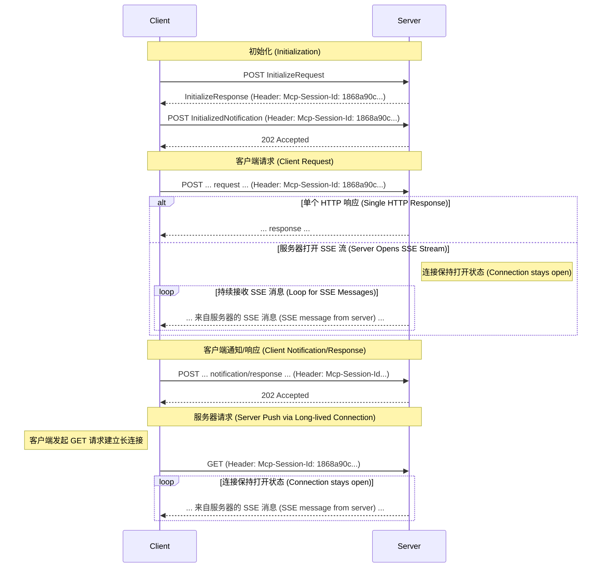

# Pixiu AI 演进

## AI 应用架构新范式

### AI 应用架构图


#### 调用链路说明

1. 用户向AI应用发起请求，请求流量进入流量网关（云原生API网关）。
2. 云原生API网关侧维护管理了不同类型的AI Agent的API或路由规则，将用户请求转发至对应的AI Agent。（可以考虑接入 A2A 协议）
3. AI Agent无论以哪种方式实现，只要其中的节点需要获取数据，便向MCP网关（云原生API网关）请求获取可用的MCP Server及MCP Tool的信息。
4. 因为MCP网关处可能维护了很多MCP信息，可以借助LLM缩小MCP范围，减少Token消耗，所以向AI网关（云原生API网关）发请求和LLM交互。（这一步可选）
5. MCP网关将确定好范围的MCPServer及MCP Tool的信息List返回给AIAgent。
6. AI Agent将用户的请求信息及从MCP网关拿到的所有MCP信息通过AI网关发送给LLM。
7. 经过LLM推理后，返回解决问题的唯一MCP Server和MCP Tool信息。
8. AI Agent拿到确定的MCP Server和MCP Tool信息后通过MCP网关对该MCP Tool做请求。

实际生产中 ③-⑧ 步会多次循环交互

### 云原生 API 网关

> [!注释]
> 南北走向流量为 client-server 的流量
> 
> 东西走向流量为 server-sever 流量
> 
> Web Application Firewall，Web应用防火墙，简称WAF

传统的流量网关和 API 网关集成的微服务网关（SpringCloud Gateway）注重于同 k8s 中的 Pod 进行交互，有东西走向流量和南北走向流量。

而**新一代网关** 增加了AI 流程的同时，有如下特点

- 流量网关、API网关，微服务网关、AI网关、MCP网关多合一

- 统一东西南北向流量

- 集成 WAF ，内容安全数据面

- 集成 AI 领域 LLM，MCP

> 差异化竞争力：服务治理、API管理、LLM管理、MCP管理 + 基本竞争力：高性能、高可用、零信任、易扩展

#### AI 网关


AI 网关集中于 AI 开发插件集，AI 安全防护，多模型适配，可观测性。

#### MCP 网关


MCP 网关在 AI 网关的基础上支持 MCP Servers Proxy，MCP Server Converter，MCP Client 身份认证，MCP Server 动态发现。


## Pixiu mcp-session 设计



Streamable http 下与 Pixiu 的通信

目前 Pixiu 开发计划，与 mcp client 的交互

第一步： 实现单个实例的情况下，将 api 服务包装成 Mcp Server，与 Mcp Client 进行通信。

```txt
客户端 ---> Pixiu ---> 后端 API
```

第二步： 在多个实例的情况下，实现服务无状态、高性能和高可用。
1. **引入 Redis (L2)**：作为共享的二级缓存，集中管理所有会话信息，解决多实例会话一致性问题。
2. **引入本地缓存 (L1)**：在各实例内使用内存作为一级缓存，极大加速热点数据的读取性能.
3. **实现缓存同步**：利用 Redis 的 Pub/Sub（发布/订阅）机制，当数据更新时，通知所有实例清空各自的本地缓存，保证数据最终一致性。


    